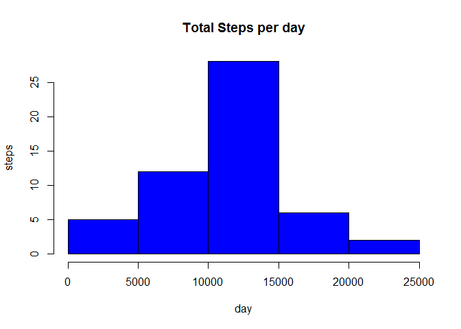

# Reproducible Research: Peer Assessment 1


## Loading and preprocessing the data
Load data from the CSV file from working directory

```r
setwd ("C:/Users/ssubbaiah/Downloads/")
act.data <- read.table(unz("activity.zip","activity.csv"), header=TRUE, sep=",")
act.data$date <- as.Date(act.data$date)
```
First few lines of the data is

```
##   steps       date interval
## 1    NA 2012-10-01        0
## 2    NA 2012-10-01        5
## 3    NA 2012-10-01       10
```

## What is mean total number of steps taken per day?
Calculate total steps per day

```r
day.steps <- aggregate(steps~date, data=act.data, sum, na.rm = TRUE)
```
First few lines of aggregated data is

```
##         date steps
## 1 2012-10-02   126
## 2 2012-10-03 11352
## 3 2012-10-04 12116
```

The steps per day is shown as histogram 
 

The mean value is here

```r
 round(mean (day.steps$steps),0)
```

```
## [1] 10766
```
The median value is here 

```r
 round(median(day.steps$steps),0)
```

```
## [1] 10765
```

## What is the average daily activity pattern?
Make a time series plot (i.e. type = "l") of the 5-minute interval (x-axis) and the average number of steps taken, averaged across all days (y-axis)
Create Time series

```r
tseries <- tapply(act.data$steps,act.data$interval,mean,na.rm=TRUE)
plot (row.names(tseries), tseries, type="l", xlab="5 min interval", ylab="Average steps - all days", main="Average Daily Activity Pattern", col="blue")
```

 

The 5 minutes interval that has maximum steps is

```r
max.5min.interval <- which.max(tseries)
names(max.5min.interval)
```

```
## [1] "835"
```

## Imputing missing values
there are a number of days/intervals where there are missing values (coded as NA). Here are the number of days with missing data

```r
NA.days <- sum(is.na(act.data))
NA.days
```

```
## [1] 2304
```
Fill NA's with interval's mean
  i) Find interval mean
  ii) create a new data set with new column for mean data
  iii) replace NA's with new columns

```r
interval.mean <- round(aggregate (steps~interval, data=act.data, FUN=mean),0)
new.act <- merge(act.data, interval.mean, by="interval", suffixes=c("",".y"))
nas.list <- is.na(act.data$steps)
new.act$steps[nas.list] <-new.act$steps.y[nas.list]
new.act <- new.act[, 1:3]
steps_p_day <- aggregate(steps~date, data=new.act, sum)
```
Bar plot after imputing missing values

```r
hist(steps_p_day$steps,  main="Total Steps per day Imputed", xlab="day", ylab="steps", col="blue")
```

 

## Are there differences in activity patterns between weekdays and weekends?
For this first create weekday and weekend factors

```r
 library(lattice)
 new.act$wkday <- ifelse(weekdays(new.act$date) %in% c("Saturday","Sunday"),"weekend","weekday")
head(new.act,5)
```

```
##   interval steps       date   wkday
## 1        0     2 2012-10-01 weekday
## 2        0     2 2012-11-23 weekday
## 3        0     2 2012-10-28 weekend
## 4        0     2 2012-11-06 weekday
## 5        0     2 2012-11-24 weekend
```

Then calculate Steps by interval and Day Type (Weekday or weekend)

```r
steps_int_wday <- aggregate(steps~interval+wkday, data=new.act, FUN="mean")
head(steps_int_wday)
```

```
##   interval   wkday    steps
## 1        0 weekday 2.000000
## 2        5 weekday 0.000000
## 3       10 weekday 0.000000
## 4       15 weekday 0.000000
## 5       20 weekday 0.000000
## 6       25 weekday 1.512821
```
Now plot it in xyplot

```r
 xyplot(steps~interval|wkday, data=steps_int_wday, type="l", layout = c(1,2), xlab="Interval", ylab="Number of Steps - mean", grid=TRUE)
```

 

*** End of -- Reproducible Research: Peer Assessment 1 ***
